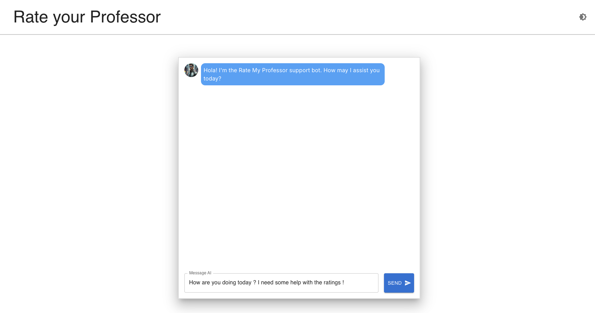

# AI-Powered RMP RAG App

## Project Overview

This project is an AI-powered Rate my Professor application powered by RAG.

### Home Page



## 🛠️ Technologies Used
<p align="center">
    
</p>
- [Next.js](https://nextjs.org/)
- [React](https://reactjs.org/)
- [OpenAI API](https://openai.com/api/)
- [Material-UI](https://material-ui.com/)
- [PineCone](https://www.pinecone.io/)

## 🚀 Live Demo

Check out the video demo of the application on YouTube: [\[Click Here!\]](https://youtu.be/HtM2SMNDGn0)

## 🏁 Getting Started

To get a local copy up and running, follow these steps:

1. Clone the repository:


```bash
git clone https://github.com/nehalpatil7/RAG-RMP.git
```

2. Navigate to the project directory:

```bash
cd rag-rmp
```

3. Install dependencies:
```bash
npm install
```

4. Set up environment variables:
Create a `.env` file in the root directory of your project & add the following environment variables:

```bash
OPENAI_API_KEY=your_openrouter_api_key

PINECONE_API_KEY=your_firebase_api_key
```
Replace the placeholder values (`your_openai_api_key`, `your_pinecone_api_key`, etc.) with your actual OpenAI and Pinecone credentials.
For the OpenAI API key, sign up at the [OpenAI website](https://openai.com/api/) to get your API key.
NOTE: The OpenRouter API keys will not work here. If you don't want to pay for OpenAI, then find another embedding model and integrate it into the code. The code will change according to the embedding model you choose. Keep keen attention on the dimensions you pass to the model.

5. Run the python script:

```bash
python3 load.py
```

6. Run the development server:

```bash
npm run dev
```

7. Open [http://localhost:3000](http://localhost:3000) with your browser to see the result.

## 🐛 Troubleshooting

If you encounter any issues while setting up or running the project, try the following:

1. Ensure all dependencies are installed:
```bash
npm install
```

2. Clear Next.js cache:
```bash
rm -rf .next
```

3. Rebuild the project:
```bash
npm run build
```

4. For OpenAI API issues, verify that your API key is correctly set in the `.env` file and that you have sufficient credits in your OpenAI account.


## 👤 Author

**Nehal Patil**

- LinkedIn: [Nehal Patil](https://www.linkedin.com/in/nehalpatil7/)
- GitHub: [@nehalpatil7](https://github.com/nehalpatil7)

## 🙏 Acknowledgments

- Headstarter AI Fellowship for the opportunity and support
- OpenAI for providing the powerful API
- All contributors and reviewers
